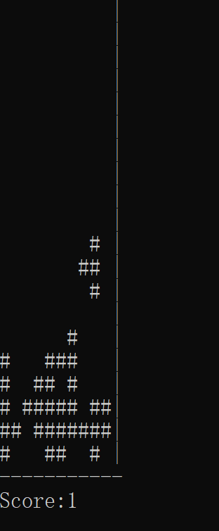

# 命令行界面俄罗斯方块——苏维埃方块

在写完背水者纪事后和学长xfgg交流，xfgg提出写俄罗斯方块是一个很好的挑战，于是搓了一个出来。

是仿俄罗斯方块游戏，算是一个半OOP项目，开发时段从我学完C一直持续（咕）到学完C++，导致这个程序编程思路既有OOP的影子又有面向过程的影子。

使用方法：在任意C++项目中，将两个.h导入为头文件，将.cpp导入为源文件，编译生成程序即可。

程序界面：

